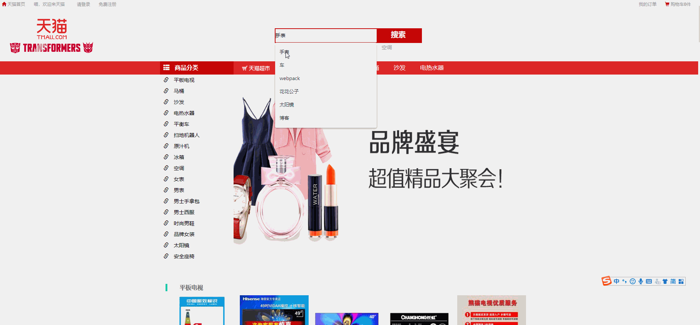
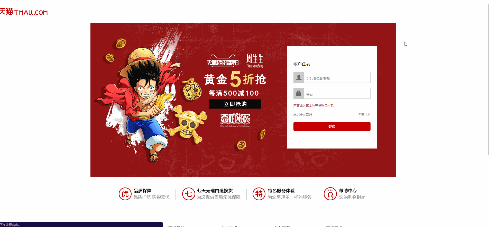
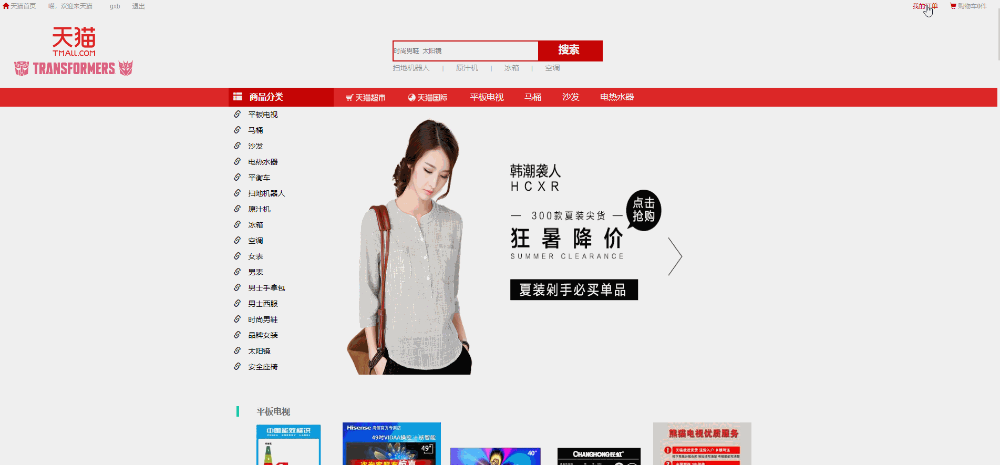

# tmall_springboot
	
	基于Springboot+vue.js的学习项目，通过Springboot整合了SpringMVC,Spring Data JPA,Redis,Shiro等技术

## 说明

> 基于SpringBoot的仿天猫系统，包括前台商城系统及后台管理系统。

> 如果该项目对您有帮助，您可以点右上角 "Star" 支持一下,谢谢！

>博客： [点这里](http://blog.geligamesh.cn)

## 项目介绍
> `tmall_springboot`项目是一套电商系统，包括前台商城系统及后台管理系统

> 前台商城系统包含首页门户、商品信息、商品搜索、商品展示、购物车、订单详情、订单流程、分类信息等模块。

> 后台管理系统包含商品管理、订单管理、用户管理、分类管理、订单管理、分类属性、商品属性值等模块。

### 项目展示
	因为服务器内存太小了部署了一个博客内存已经快不够了所以就没把项目部署上去，到时候换一台内存更大的服务器之后再部署项目- -|||...

### 技术选型

技术 | 说明 | 官网
----|----|----
Spring Boot | MVC框架 | [https://spring.io/projects/spring-boot](https://spring.io/projects/spring-boot)
Shiro | 认证和授权框架 | [https://spring.io/projects/spring-security](https://spring.io/projects/spring-security)
Elasticsearch | 搜索引擎 | [https://github.com/elastic/elasticsearch](https://github.com/elastic/elasticsearch)
Redis | 分布式缓存 | [https://redis.io/](https://redis.io/)
Druid | 数据库连接池 | [https://github.com/alibaba/druid](https://github.com/alibaba/druid)
Vue.js | 前端框架 | [https://vuejs.org/](https://vuejs.org/)

